```{r setup, include=FALSE}
knitr::opts_chunk$set(
  echo = TRUE,
  warning = FALSE)
```

### Библиотеки

```{r message = FALSE}
library(readr)
library(visdat)
library(igraph)
library(tidyverse)
library(forcats)
library(tidyr)
library(knitr)
library(ggplot2)
library(visNetwork)
library(RColorBrewer)
```

## Описание данных

**«Игра престолов»** — телесериал канала HBO, основанный на серии книг Джорджа Мартина «Песнь Льда и Пламени». Мы проанализируем сеть совпадений персонажей книг «Игры престолов».

<div style="display:flex; justify-content:center; margin:25px 0;">
  <figure style="text-align:center;">
    
  </figure>
</div>

Мы используем [набор данных](https://www.kaggle.com/datasets/mmmarchetti/game-of-thrones-dataset) с Kaggle. В узлах нашей сети — персонажи, в рёбрах — их совместные появления в главах по книгам 1-5. Таким образом, каждая книга формирует отдельный слой сети, что позволяет изучить её эволюцию во времени.

### Исследовательский вопрос

Как меняется структура сети персонажей по книгам — появляются ли новые кластеры, и как изменяются центральные узлы с течением времени?

Для анализа мы планируем построить *графы*, вычислить метрики *центральности* (`degree`, `betweenness`, `closeness`), *проанализировать кластерную структуру* и *визуализировать изменения сети* во времени.

### Импорт данных

```{r message=FALSE}
book1 <- read_csv("book1.csv")
book2 <- read_csv("book2.csv")
book3 <- read_csv("book3.csv")
book4 <- read_csv("book4.csv")
book5 <- read_csv("book5.csv")

head(book1)
```

### Структура данных

| Переменная | Тип данных | Описание |
|------------------------|------------------------|------------------------|
| **Source** | `chr` | Имя персонажа, от которого идёт связь (узел-источник). |
| **Target** | `chr` | Имя персонажа, к которому идёт связь (узел-получатель). |
| **Type** | `chr` | Тип связи; в данных — всегда *Undirected* (неориентированная связь между персонажами). |
| **weight** | `num` | Вес ребра — насколько часто персонажи взаимодействуют или появляются вместе. |
| **book** | `num` | Номер книги (1–5), к которой относится данная пара персонажей. |

### Пропуски и дубликаты

```{r}
colSums(is.na(book2))
```

Видим, что есть один пропуск во второй книге, добавим значение:

```{r}
book2[775, "book"] <- 2
# vis_miss(book2)
```

## Графы

Мы будем строить графы для каждой книги по отдельности, потому что хотим проанализировать как меняется структура сети персонажей с течением времени.

```{r}
g1 <- graph_from_data_frame(book1[, c("Source", "Target")], directed = FALSE)
g2 <- graph_from_data_frame(book2[, c("Source", "Target")], directed = FALSE)
g3 <- graph_from_data_frame(book3[, c("Source", "Target")], directed = FALSE)
g4 <- graph_from_data_frame(book4[, c("Source", "Target")], directed = FALSE)
g5 <- graph_from_data_frame(book5[, c("Source", "Target")], directed = FALSE)
```

Присвоим веса к каждому графу:

```{r}
E(g1)$weight <- book1$weight
E(g2)$weight <- book2$weight
E(g3)$weight <- book3$weight
E(g4)$weight <- book4$weight
E(g5)$weight <- book5$weight
```

## Описательная статистика

```{r}
graphs <- list(
"Книга 1" = g1,
"Книга 2" = g2,
"Книга 3" = g3,
"Книга 4" = g4,
"Книга 5" = g5
)

summary_tbl <- purrr::imap_dfr(graphs, ~ tibble(
Книга = .y,
Узлы = vcount(.x),
Рёбра = ecount(.x),
Плотность = edge_density(.x),
"Средняя степень (degree)" = mean(degree(.x)),
"Средняя длина пути" = mean_distance(.x, directed = FALSE, unconnected = TRUE)
))

kable(summary_tbl, digits = 3, caption = "Описательные характеристики сети по книгам")
```

* **Узлы**: количествво растет от книги к книге (с 187 в первой книге до 317 в пятой) => отражает расширение мира: появляются новые линии, новые дома, новые второстепенные герои.

* **Рёбра**: в целом количество увеличивается, но не так быстро, как число узлов — с 684 до 760 (при этом максимум 1008 рёбер в книге 3). То есть новых персонажей становится много, но каждый из них взаимодействует не со «всеми подряд», а с ограниченным кругом.

* **Плотность сети**:  постепенно падает с 0.039 в книге 1 до 0.015 в книге 5. Из всех теоретически возможных связей используется всё меньшая часть, мир становится более разбросанным, а сюжет разделяется на отдельные линии.

* **Degree**: уменьшается с 7.32 до 4.80. В среднем один персонаж взаимодействует с меньшим количеством других, сеть становится менее «переплетённой» и более локальной — у героев формируются свои отдельные круги общения.

* **Длина пути**: увеличивается с 14.11 в книге 1 до максимума 18.47 в книге 4, а затем немного снижается до 17.40 в книге 5 => чтобы связать двух случайных персонажей, нужно пройти через всё большее количество «посредников», сеть становится более растянутой и фрагментированной.

## Центральность

### Книга 1

#### Degree centrality (Степень центральности)

```{r}
deg1 <- head(sort(degree(g1,  mode = "all"), decreasing = TRUE), 5)
deg1
```

Больше всех связей в книге имеют:

1. **Эддард Старк** — ключевой персонаж первой книги, глава клана Старков, лорд Винтерфелла, активно взаимодействующий и с королевской властью, и со своей семьёй.
2. **Роберт Баратеон** — король Семи Королевств, вокруг него группируются множество персонажей: члены двора, советники, союзники и старые знакомые.
3. **Тирион Ланнистер** — младший Ланнистер, человек с широким кругом контактов благодаря своему уму, остроумию и наблюдательности.
4. **Кейтилин Старк** — мама семейства Старков, активно перемещается и участвует в расследованиях и дипломатических миссиях.
5. **Джон Сноу** — бастард Эддарда Старка, обаяшка кучеряшка, новичок в Ночном Дозоре, взаимодействующий с членами братства и с персонажами из родного Винтерфелла.

<div style="display:flex; justify-content:center; gap:15px; margin-top:20px; flex-wrap:nowrap;">

  <figure style="text-align:center;">
    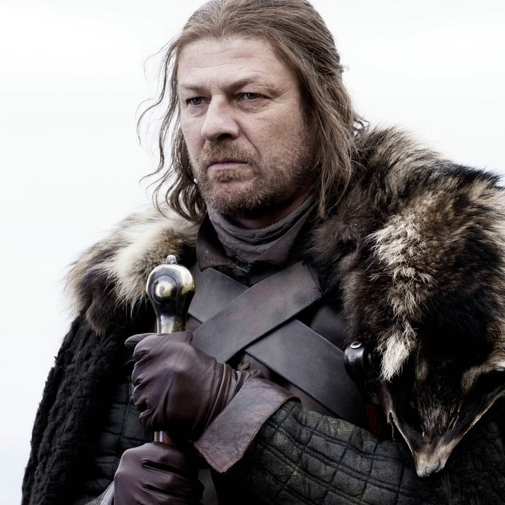
    <figcaption style="margin-top:6px; font-size:14px; color:#555;">Эддард Старк</figcaption>
  </figure>

  <figure style="text-align:center;">
    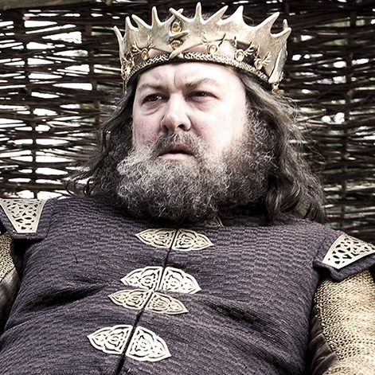
    <figcaption style="margin-top:6px; font-size:14px; color:#555;">Роберт Баратеон</figcaption>
  </figure>

  <figure style="text-align:center;">
    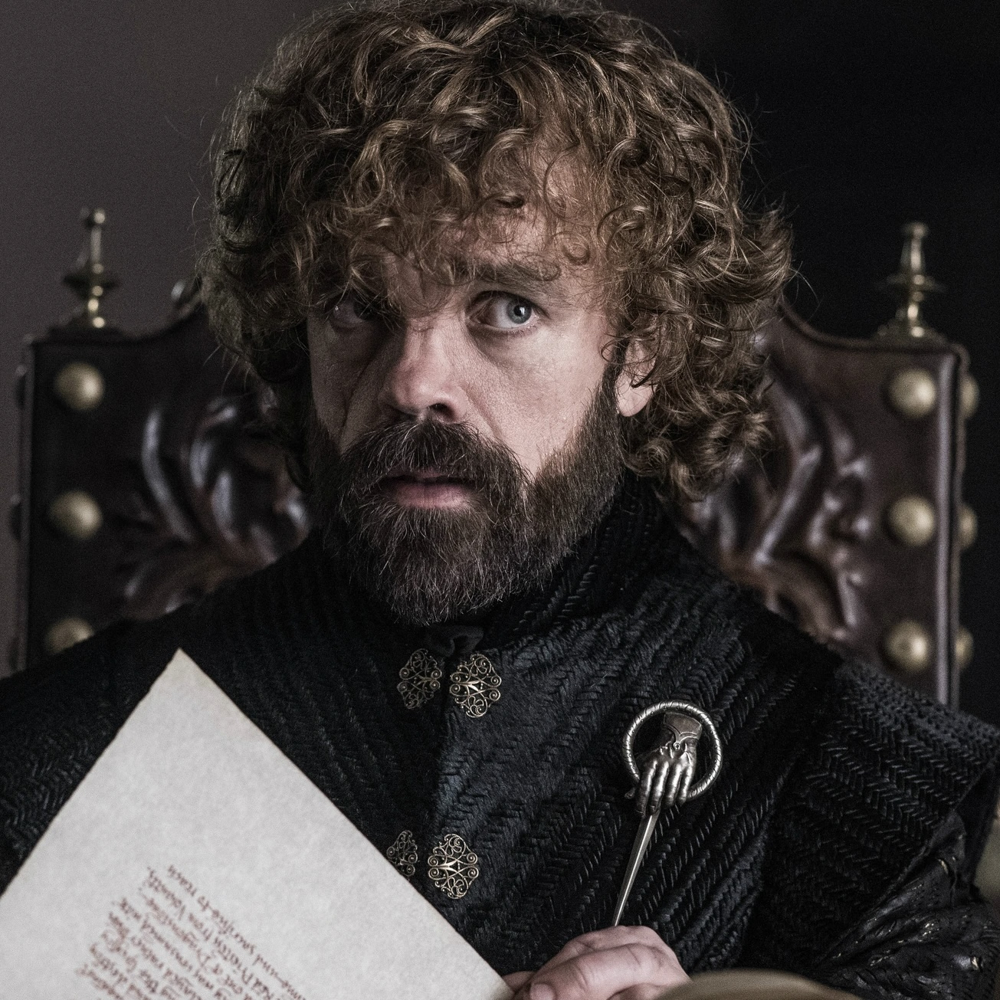
    <figcaption style="margin-top:6px; font-size:14px; color:#555;">Тирион Ланнистер</figcaption>
  </figure>

  <figure style="text-align:center;">
    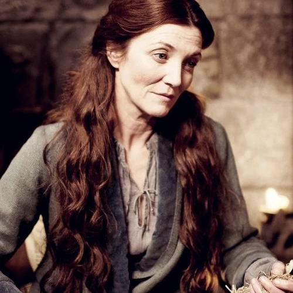
    <figcaption style="margin-top:6px; font-size:14px; color:#555;">Кейтилин Старк</figcaption>
  </figure>

  <figure style="text-align:center;">
    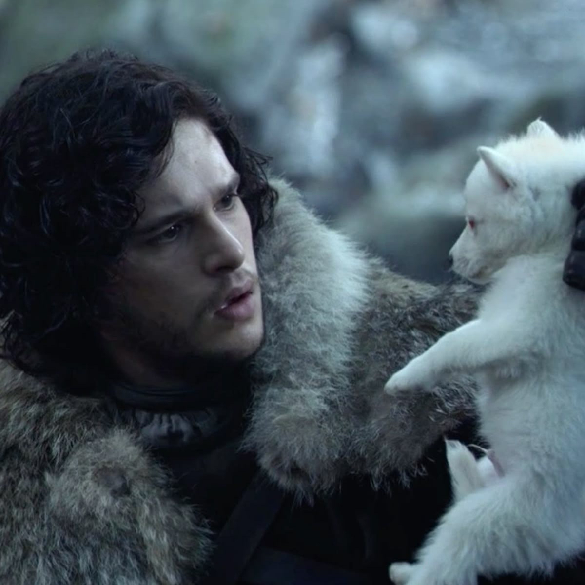
    <figcaption style="margin-top:6px; font-size:14px; color:#555;">Джон Сноу</figcaption>
  </figure>

</div>

#### Betweenness (Битвинность)

```{r}
bet1 <- head(sort(betweenness(g1, directed = F), decreasing = TRUE), 5)
bet1
```

Больше всего "мостов" между другими персонажами имеют:

1. **Роберт Баратеон** — соединяет множество различных групп: Старков, Ланнистеров, Малый Совет, воинов и придворных.
2. **Эддард Старк** — становится связующим звеном между прошлым Роберта, дворцовыми интригами и северными линиями.
3. **Тирион Ланнистер** — выполняет роль посредника между домами, поскольку часто оказывается в ситуациях, где два персонажа никак не связаны напрямую.
4. **Робб Старк** — старший сын Старков, объединяет северные дома, вводя в сеть самостоятельную политическую линию.
5. **Кейтилин Старк** — связывает политические силы северян и южан.

<div style="display:flex; justify-content:center; gap:15px; margin-top:20px; flex-wrap:nowrap;">

  <figure style="text-align:center;">
    
    <figcaption style="margin-top:6px; font-size:14px; color:#555;">Роберт Баратеон</figcaption>
  </figure>

  <figure style="text-align:center;">
    
    <figcaption style="margin-top:6px; font-size:14px; color:#555;">Эддард Старк</figcaption>
  </figure>

  <figure style="text-align:center;">
    
    <figcaption style="margin-top:6px; font-size:14px; color:#555;">Тирион Ланнистер</figcaption>
  </figure>

  <figure style="text-align:center;">
    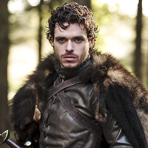
    <figcaption style="margin-top:6px; font-size:14px; color:#555;">Робб Старк</figcaption>
  </figure>

  <figure style="text-align:center;">
    
    <figcaption style="margin-top:6px; font-size:14px; color:#555;">Кейтилин Старк</figcaption>
  </figure>

</div>

#### Closeness (Близость)

```{r}
clo1 <- head(sort(closeness(g1,mode = "all"), decreasing = TRUE), 5)
clo1
```

Ближе всех к другим персонажам в книге:

1. **Роберт Баратеон** — структурно «близок» ко многим узлам сети благодаря широкому набору связей.
2. **Тирион Ланнистер** — слегка в стороне от основных интриг, но всегда вовлечён в разные линии, из-за чего многие персонажи находятся «на коротком расстоянии» от него.
3. **Джейме Ланнистер** — брат Тириона, гад каких поискать, один из центральных членов своей династии, взаимодействующий и с королём, ~~и с королевой~~, и с влиятельными домами.
4. **Лорас Тирелл** — представитель важного дома, один из самых искусных рыцарей Вестероса, часто фигурирующий рядом с ключевыми персонажами двора.
5. **Эддард Старк** — его роль в столице в первой книге делает его одним из наиболее «близких» узлов в сети.

<div style="display:flex; justify-content:center; gap:15px; margin-top:20px; flex-wrap:nowrap;">

  <figure style="text-align:center;">
    
    <figcaption style="margin-top:6px; font-size:14px; color:#555;">Роберт Баратеон</figcaption>
  </figure>

  <figure style="text-align:center;">
    
    <figcaption style="margin-top:6px; font-size:14px; color:#555;">Тирион Ланнистер</figcaption>
  </figure>

  <figure style="text-align:center;">
    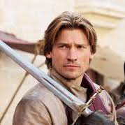
    <figcaption style="margin-top:6px; font-size:14px; color:#555;">Джейме Ланнистер</figcaption>
  </figure>

  <figure style="text-align:center;">
    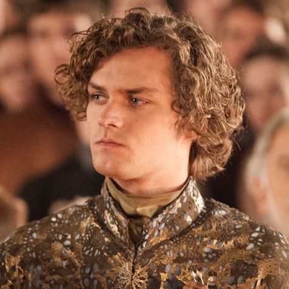
    <figcaption style="margin-top:6px; font-size:14px; color:#555;">Лорас Тиррел</figcaption>
  </figure>

  <figure style="text-align:center;">
    
    <figcaption style="margin-top:6px; font-size:14px; color:#555;">Эддард Старк</figcaption>
  </figure>

</div>

### Книга 2

#### Degree centrality (Степень центральности)

```{r}
deg2 <- head(sort(degree(g2,  mode = "all"), decreasing = TRUE), 5)
deg2
```

Больше всех связей в книге имеют:

1. **Тирион Ланнистер** — главный «менеджер хаоса» при дворе, постоянно взаимодействует и с семьёй, и с советом.
2. **Джоффри Баратеон** — новый король (сын Серсеи Ланнистер и Роберта Баратеона...~~или нет~~), вокруг которого крутится придворная политика и конфликты.
3. **Серсея Ланнистер** — сестра-близняшка Джейме Ланнистера, королева-регент, связана и с Ланнистерами, и с союзниками двора.
4. **Арья Старк** — младшая дочь Эддарда Старка, активно перемещается между разными группами персонажей, попадает в разные среды.
5. **Станнис Баратеон** — брат Роберта, претендент на трон, вокруг которого формируется отдельное политическое окружение.

<div style="display:flex; justify-content:center; gap:15px; margin-top:20px; flex-wrap:nowrap;">

  <figure style="text-align:center;">
    
    <figcaption style="margin-top:6px; font-size:14px; color:#555;">Тирион Ланнистер</figcaption>
  </figure>

  <figure style="text-align:center;">
    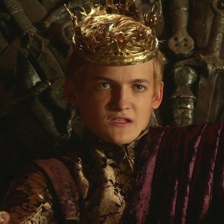
    <figcaption style="margin-top:6px; font-size:14px; color:#555;">Джоффри Баратеон</figcaption>
  </figure>

  <figure style="text-align:center;">
    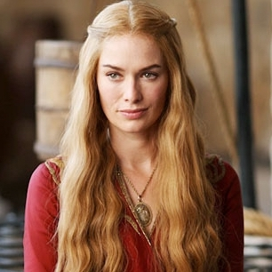
    <figcaption style="margin-top:6px; font-size:14px; color:#555;">Серсея Ланнистер</figcaption>
  </figure>

  <figure style="text-align:center;">
    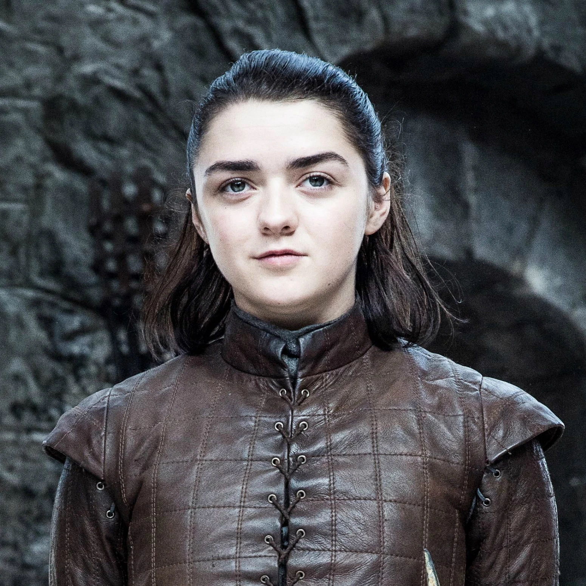
    <figcaption style="margin-top:6px; font-size:14px; color:#555;">Арья Старк</figcaption>
  </figure>

  <figure style="text-align:center;">
    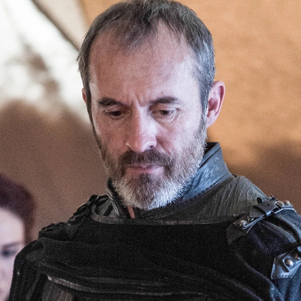
    <figcaption style="margin-top:6px; font-size:14px; color:#555;">Станнис Баратеон</figcaption>
  </figure>

</div>

#### Betweenness (Битвинность)

```{r}
bet2 <- head(sort(betweenness(g2, directed = F), decreasing = TRUE), 5)
bet2
```

Больше всего "мостов" между другими персонажами имеют:

1. **Джейме Ланнистер** — опытный воин, связывающий линии войны, плена и придворных интриг.
2. **Роберт Баратеон** — сохраняет влияние через наследие и связи других персонажей.
3. **Джон Сноу** — соединяет северные и южные события.
4. **Арья Старк** — перемещается между разными группами, становится посредником.
5. **Робб Старк** — лидер северной коалиции, объединяющий несколько домов.

<div style="display:flex; justify-content:center; gap:15px; margin-top:20px; flex-wrap:nowrap;">

  <figure style="text-align:center;">
    
    <figcaption style="margin-top:6px; font-size:14px; color:#555;">Джейме Ланнистер</figcaption>
  </figure>

  <figure style="text-align:center;">
    
    <figcaption style="margin-top:6px; font-size:14px; color:#555;">Роберт Баратеон</figcaption>
  </figure>

  <figure style="text-align:center;">
    
    <figcaption style="margin-top:6px; font-size:14px; color:#555;">Джон Сноу</figcaption>
  </figure>

  <figure style="text-align:center;">
    
    <figcaption style="margin-top:6px; font-size:14px; color:#555;">Арья Старк</figcaption>
  </figure>

  <figure style="text-align:center;">
    
    <figcaption style="margin-top:6px; font-size:14px; color:#555;">Робб Старк</figcaption>
  </figure>

</div>

#### Closeness (Близость)

```{r}
clo2 <- head(sort(closeness(g2,mode = "all"), decreasing = TRUE), 5)
clo2
```

Ближе всех к другим персонажам в книге:

1. **Роберт Баратеон** — структурно важный узел, через который косвенно проходят многие пути.
2. **Джейме Ланнистер** — остаётся близким ко многим узлам благодаря роли в войне.
3. **Арья Старк** — перемещение делает её структурно «доступной» для разных групп.
4. **Кейтилин Старк** — дипломатическая фигура, соединяющая северян и южан.
5. **Джоффри Баратеон** — политический центр столицы.

<div style="display:flex; justify-content:center; gap:15px; margin-top:20px; flex-wrap:nowrap;">

  <figure style="text-align:center;">
    
    <figcaption style="margin-top:6px; font-size:14px; color:#555;">Роберт Баратеон</figcaption>
  </figure>

  <figure style="text-align:center;">
    
    <figcaption style="margin-top:6px; font-size:14px; color:#555;">Джейме Ланнистер</figcaption>
  </figure>

  <figure style="text-align:center;">
    
    <figcaption style="margin-top:6px; font-size:14px; color:#555;">Арья Старк</figcaption>
  </figure>

  <figure style="text-align:center;">
    
    <figcaption style="margin-top:6px; font-size:14px; color:#555;">Кейтилин Старк</figcaption>
  </figure>

  <figure style="text-align:center;">
    
    <figcaption style="margin-top:6px; font-size:14px; color:#555;">Джоффри Баратеон</figcaption>
  </figure>

</div>

### Книга 3

#### Degree centrality (Степень центральности)

```{r}
deg3 <- head(sort(degree(g3,  mode = "all"), decreasing = TRUE), 5)
deg3
```

Больше всех связей в книге имеют:

1. **Тирион Ланнистер** — ключевой придворный стратег, активно вовлечённый в политические события.
2. **Джон Сноу** — брат Ночного Дозора, взаимодействующий с одичалыми и союзниками.
3. **Джоффри Баратеон** — король, вокруг которого крутится придворная динамика.
4. **Робб Старк** — король Севера, объединяющий северные дома.
5. **Санса Старк** — придворная фигура, связанная с разными домами через интриги.

<div style="display:flex; justify-content:center; gap:15px; margin-top:20px; flex-wrap:nowrap;">

  <figure style="text-align:center;">
    
    <figcaption style="margin-top:6px; font-size:14px; color:#555;">Тирион Ланнистер</figcaption>
  </figure>

  <figure style="text-align:center;">
    
    <figcaption style="margin-top:6px; font-size:14px; color:#555;">Джон Сноу</figcaption>
  </figure>

  <figure style="text-align:center;">
    
    <figcaption style="margin-top:6px; font-size:14px; color:#555;">Джоффри Баратеон</figcaption>
  </figure>

  <figure style="text-align:center;">
    
    <figcaption style="margin-top:6px; font-size:14px; color:#555;">Робб Старк</figcaption>
  </figure>

  <figure style="text-align:center;">
    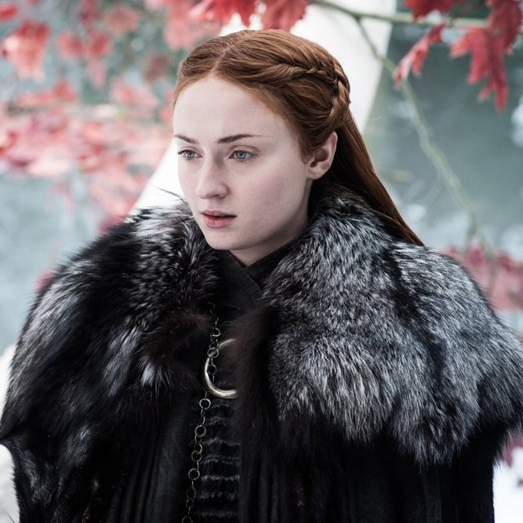
    <figcaption style="margin-top:6px; font-size:14px; color:#555;">Санса Старк</figcaption>
  </figure>

</div>

#### Betweenness (Битвинность)

```{r}
bet3 <- head(sort(betweenness(g3, directed = F), decreasing = TRUE), 5)
bet3
```

Больше всего "мостов" между другими персонажами имеют:

1. **Джоффри Баратеон** — центр столичной политики, соединяющий множество фракций.
2. **Роберт Баратеон** — остаётся структурно важным через связи и последствия его правления.
3. **Джон Сноу** — соединяет линии Стены, одичалых и южные события.
4. **Станнис Баратеон** — претендент на трон, объединяющий северные и южные ветки.
5. **Кейтилин Старк** — дипломатический узел, соединяющий несколько домов.

<div style="display:flex; justify-content:center; gap:15px; margin-top:20px; flex-wrap:nowrap;">

  <figure style="text-align:center;">
    
    <figcaption style="margin-top:6px; font-size:14px; color:#555;">Джоффри Баратеон</figcaption>
  </figure>

  <figure style="text-align:center;">
    
    <figcaption style="margin-top:6px; font-size:14px; color:#555;">Роберт Баратеон</figcaption>
  </figure>

  <figure style="text-align:center;">
    
    <figcaption style="margin-top:6px; font-size:14px; color:#555;">Джон Сноу</figcaption>
  </figure>

  <figure style="text-align:center;">
    
    <figcaption style="margin-top:6px; font-size:14px; color:#555;">Станнис Баратеон</figcaption>
  </figure>

  <figure style="text-align:center;">
    
    <figcaption style="margin-top:6px; font-size:14px; color:#555;">Кейтилин Старк</figcaption>
  </figure>

</div>

#### Closeness (Близость)

```{r}
clo3 <- head(sort(closeness(g3,mode = "all"), decreasing = TRUE), 5)
clo3
```

Ближе всех к другим персонажам в книге:

1. **Джоффри Баратеон** — важный узел придворной сети с минимальными расстояниями до других.
2. **Роберт Баратеон** — сохраняет структурную значимость в сети.
3. **Эддард Старк** — остаётся «близким» узлом благодаря связям других персонажей.
4. **Станнис Баратеон** — становится ближе к политическому ядру.
5. **Тирион Ланнистер** — один из наиболее доступных узлов столицы.

<div style="display:flex; justify-content:center; gap:15px; margin-top:20px; flex-wrap:nowrap;">

  <figure style="text-align:center;">
    
    <figcaption style="margin-top:6px; font-size:14px; color:#555;">Джоффри Баратеон</figcaption>
  </figure>

  <figure style="text-align:center;">
    
    <figcaption style="margin-top:6px; font-size:14px; color:#555;">Роберт Баратеон</figcaption>
  </figure>

  <figure style="text-align:center;">
    
    <figcaption style="margin-top:6px; font-size:14px; color:#555;">Эддард Старк</figcaption>
  </figure>

  <figure style="text-align:center;">
    
    <figcaption style="margin-top:6px; font-size:14px; color:#555;">Станнис Баратеон</figcaption>
  </figure>

  <figure style="text-align:center;">
    
    <figcaption style="margin-top:6px; font-size:14px; color:#555;">Тирион Ланнистер</figcaption>
  </figure>

</div>

### Книга 4

#### Degree centrality (Степень центральности)

```{r}
deg4 <- head(sort(degree(g4,  mode = "all"), decreasing = TRUE), 5)
deg4
```

Больше всех связей в книге имеют:

1. **Джейме Ланнистер** — активно перемещается и взаимодействует с разными домами.
2. **Серсея Ланнистер** — королева-регент, управляющая придворными интригами.
3. **Бриенна Тарт** — странствующая рыцарственная героиня, пересекающая множество линий.
4. **Тирион Ланнистер** — формирует новые связи во время путешествий.
5. **Маргери Тирелл** — представительница дома Тиреллов, важная придворная фигура.

<div style="display:flex; justify-content:center; gap:15px; margin-top:20px; flex-wrap:nowrap;">

  <figure style="text-align:center;">
    
    <figcaption style="margin-top:6px; font-size:14px; color:#555;">Джейме Ланнистер</figcaption>
  </figure>

  <figure style="text-align:center;">
    
    <figcaption style="margin-top:6px; font-size:14px; color:#555;">Серсея Ланнистер</figcaption>
  </figure>

  <figure style="text-align:center;">
    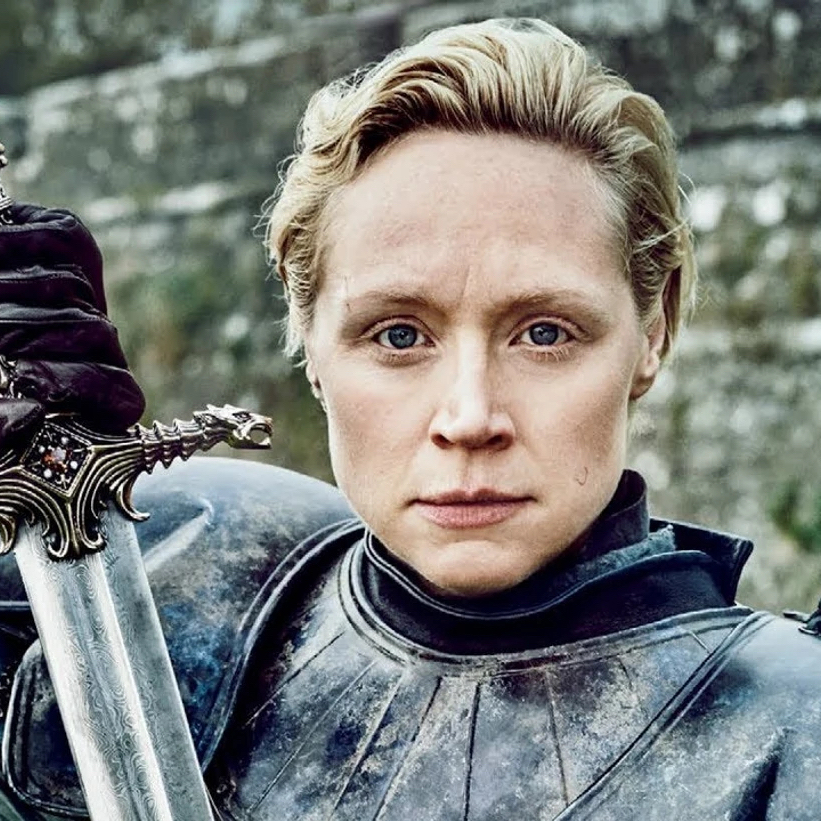
    <figcaption style="margin-top:6px; font-size:14px; color:#555;">Бриенна Тарт</figcaption>
  </figure>

  <figure style="text-align:center;">
    
    <figcaption style="margin-top:6px; font-size:14px; color:#555;">Тирион Ланнистер</figcaption>
  </figure>

  <figure style="text-align:center;">
    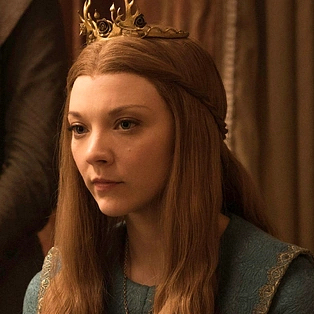
    <figcaption style="margin-top:6px; font-size:14px; color:#555;">Маргери Тирелл</figcaption>
  </figure>

</div>

#### Betweenness (Битвинность)

```{r}
bet4 <- head(sort(betweenness(g4, directed = F), decreasing = TRUE), 5)
bet4
```

Больше всего "мостов" между другими персонажами имеют:

1. **Станнис Баратеон** — стратегический узел, соединяющий политические линии Севера и Юга.
2. **Бейлон Грейджой** — правитель Железных островов, узел морских сюжетов.
3. **Джейме Ланнистер** — связывает разные фрагменты сети.
4. **Бейлор Блэктайд** — посредник в морской линии Грейджоев (в сериале дом Блэктдайд почти не упоминался).
5. **Серсея Ланнистер** — центр придворной политики.

<div style="display:flex; justify-content:center; gap:15px; margin-top:20px; flex-wrap:nowrap;">

  <figure style="text-align:center;">
    
    <figcaption style="margin-top:6px; font-size:14px; color:#555;">Станнис Баратеон</figcaption>
  </figure>

  <figure style="text-align:center;">
    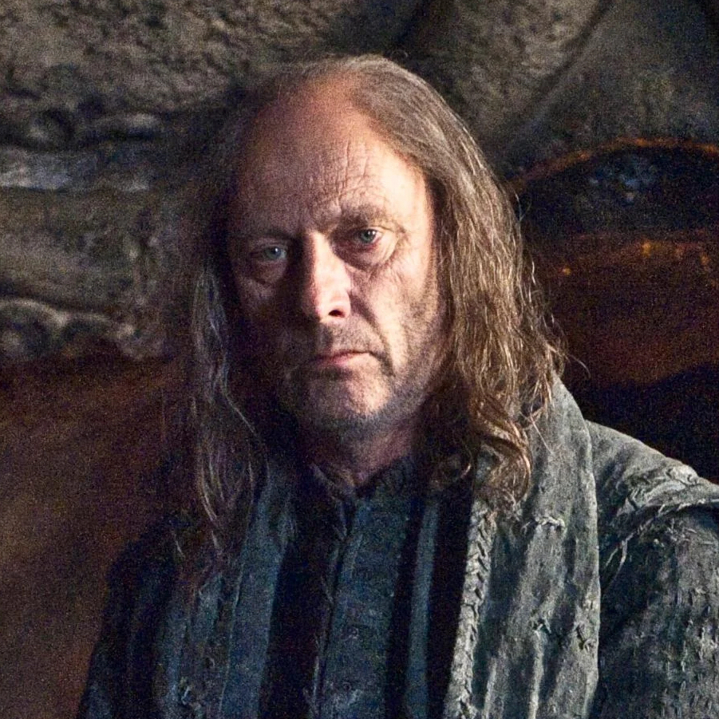
    <figcaption style="margin-top:6px; font-size:14px; color:#555;">Бейлон Грейджой</figcaption>
  </figure>

  <figure style="text-align:center;">
    
    <figcaption style="margin-top:6px; font-size:14px; color:#555;">Джейме Ланнистер</figcaption>
  </figure>

  <figure style="text-align:center;">
    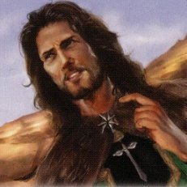
    <figcaption style="margin-top:6px; font-size:14px; color:#555;">Бейлор Блэктайд</figcaption>
  </figure>

  <figure style="text-align:center;">
    
    <figcaption style="margin-top:6px; font-size:14px; color:#555;">Серсея Ланнистер</figcaption>
  </figure>

</div>

#### Closeness (Близость)

```{r}
clo4 <- head(sort(closeness(g4,mode = "all"), decreasing = TRUE), 5)
clo4
```

Ближе всех к другим персонажам в книге:

1. **Тирион Ланнистер** — остаётся близким ко многим узлам благодаря путешествиям.
2. **Станнис Баратеон** — один из центральных участников борьбы за власть.
3. **Санса Старк** — соединяет линии Долины, Винтерфелла и придворных интриг.
4. **Серсея Ланнистер** — важное политическое лицо столицы.
5. **Тайвин Ланнистер** — сохраняет структурную значимость через свои связи.

<div style="display:flex; justify-content:center; gap:15px; margin-top:20px; flex-wrap:nowrap;">

  <figure style="text-align:center;">
    
    <figcaption style="margin-top:6px; font-size:14px; color:#555;">Тирион Ланнистер</figcaption>
  </figure>

  <figure style="text-align:center;">
    
    <figcaption style="margin-top:6px; font-size:14px; color:#555;">Станнис Баратеон</figcaption>
  </figure>

  <figure style="text-align:center;">
    
    <figcaption style="margin-top:6px; font-size:14px; color:#555;">Санса Старк</figcaption>
  </figure>

  <figure style="text-align:center;">
    
    <figcaption style="margin-top:6px; font-size:14px; color:#555;">Серсея Ланнистер</figcaption>
  </figure>

  <figure style="text-align:center;">
    
    <figcaption style="margin-top:6px; font-size:14px; color:#555;">Тайвин Ланнистер</figcaption>
  </figure>

</div>

### Книга 5

#### Degree centrality (Степень центральности)

```{r}
deg5 <- head(sort(degree(g5,  mode = "all"), decreasing = TRUE), 5)
deg5
```

Больше всех связей в книге имеют:

1. **Джон Сноу** — лорд-командующий Ночного Дозора, объединяющий Стену, одичалых и северян.
2. **Дейенерис Таргариен** — Мать драконов, центр политических союзов Эссоса.
3. **Станнис Баратеон** — претендент на трон, ведущий кампанию на Севере.
4. **Теон Грейджой** — фигура северной линии, связанная с домами Грейджоев и Старков.
5. **Тирион Ланнистер** — путешествует по Эссосу, расширяя сеть контактов.

<div style="display:flex; justify-content:center; gap:15px; margin-top:20px; flex-wrap:nowrap;">

  <figure style="text-align:center;">
    
    <figcaption style="margin-top:6px; font-size:14px; color:#555;">Джон Сноу</figcaption>
  </figure>

  <figure style="text-align:center;">
    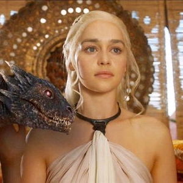
    <figcaption style="margin-top:6px; font-size:14px; color:#555;">Дейенерис Таргариен</figcaption>
  </figure>

  <figure style="text-align:center;">
    
    <figcaption style="margin-top:6px; font-size:14px; color:#555;">Станнис Баратеон</figcaption>
  </figure>

  <figure style="text-align:center;">
    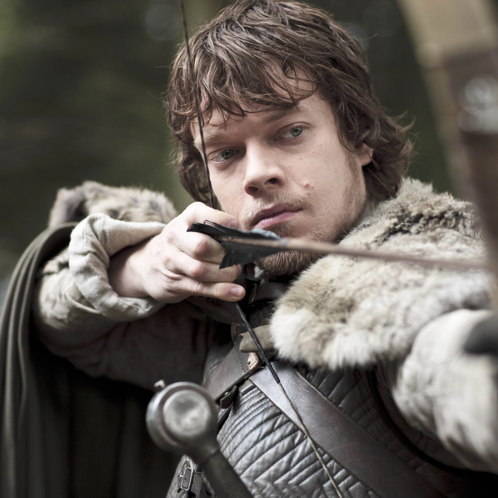
    <figcaption style="margin-top:6px; font-size:14px; color:#555;">Теон Грейджой</figcaption>
  </figure>

  <figure style="text-align:center;">
    
    <figcaption style="margin-top:6px; font-size:14px; color:#555;">Тирион Ланнистер</figcaption>
  </figure>

</div>

#### Betweenness (Битвинность)

```{r}
bet5 <- head(sort(betweenness(g5, directed = F), decreasing = TRUE), 5)
bet5
```

Больше всего "мостов" между другими персонажами имеют:

1. **Станнис Баратеон** — главный посредник книги, соединяющий северные, стенные и южные линии.
2. **Дейенерис Таргариен** — объединяет множество групп Эссоса.
3. **Джон Сноу** — связывает одичалых, Дозор и северные дома.
4. **Роберт Баратеон** — сохраняет структурную важность через своё наследие.
5. **Аша Грейджой** — ключевой посредник в линии Железных островов.

<div style="display:flex; justify-content:center; gap:15px; margin-top:20px; flex-wrap:nowrap;">

  <figure style="text-align:center;">
    
    <figcaption style="margin-top:6px; font-size:14px; color:#555;">Станнис Баратеон</figcaption>
  </figure>

  <figure style="text-align:center;">
    
    <figcaption style="margin-top:6px; font-size:14px; color:#555;">Дейенерис Таргариен</figcaption>
  </figure>

  <figure style="text-align:center;">
    
    <figcaption style="margin-top:6px; font-size:14px; color:#555;">Джон Сноу</figcaption>
  </figure>

  <figure style="text-align:center;">
    
    <figcaption style="margin-top:6px; font-size:14px; color:#555;">Роберт Баратеон</figcaption>
  </figure>

  <figure style="text-align:center;">
    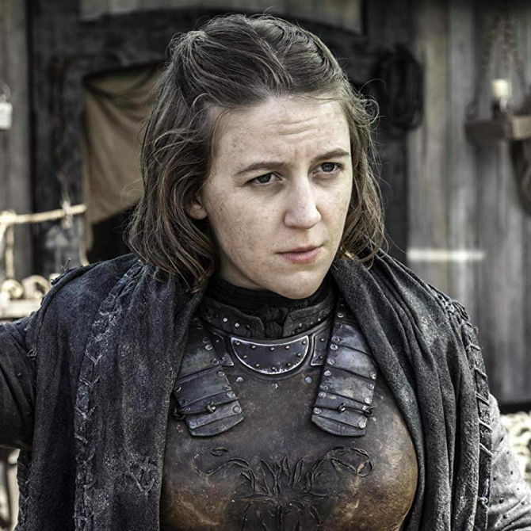
    <figcaption style="margin-top:6px; font-size:14px; color:#555;">Аша Грейджой</figcaption>
  </figure>

</div>

#### Closeness (Близость)

```{r}
clo5 <- head(sort(closeness(g5,mode = "all"), decreasing = TRUE), 5)
clo5
```

Ближе всех к другим персонажам в книге:

1. **Станнис Баратеон** — один из наиболее «доступных» узлов сети пятой книги.
2. **Роберт Баратеон** — его влияние остаётся структурно значимым.
3. **Тайвин Ланнистер** — ключевая фигура, важная через связи других узлов.
4. **Тирион Ланнистер** — остаётся структурно близким к разным группам.
5. **Серсея Ланнистер** — политический центр столицы.

<div style="display:flex; justify-content:center; gap:15px; margin-top:20px; flex-wrap:nowrap;">

  <figure style="text-align:center;">
    
    <figcaption style="margin-top:6px; font-size:14px; color:#555;">Станнис Баратеон</figcaption>
  </figure>

  <figure style="text-align:center;">
    
    <figcaption style="margin-top:6px; font-size:14px; color:#555;">Роберт Баратеон</figcaption>
  </figure>

  <figure style="text-align:center;">
    
    <figcaption style="margin-top:6px; font-size:14px; color:#555;">Тайвин Ланнистер</figcaption>
  </figure>

  <figure style="text-align:center;">
    
    <figcaption style="margin-top:6px; font-size:14px; color:#555;">Тирион Ланнистер</figcaption>
  </figure>

  <figure style="text-align:center;">
    
    <figcaption style="margin-top:6px; font-size:14px; color:#555;">Серсея Ланнистер</figcaption>
  </figure>

</div>

## Кластеризация сети

### Сравнение алгоритмов кластеризации

Сравним **модулярность**, чтобы определить какой из методов нам больше всего подойдет.

```{r}
#присваиваем
graphs <- list(g1 = g1, g2 = g2, g3 = g3, g4 = g4, g5 = g5)

algo <- function(x){
  set.seed(123)
  louvain_comm <- cluster_louvain(x, weights = E(x)$weight)
  fg_comm = cluster_fast_greedy(x, weights = E(x)$weight)
  wt_comm = cluster_walktrap(x, weights = E(x)$weight)
  lp_comm = cluster_label_prop(x, weights = E(x)$weight)
  im_comm = cluster_infomap(x, e.weights = E(x)$weight)
  
  tibble(
    Algorithm = c("Louvain", "Walktrap", "Fast Greedy", "Infomap", "Label Prop"),
    Modularity = c(
      modularity(louvain_comm),
      modularity(fg_comm),
      modularity(wt_comm),
      modularity(im_comm),
      modularity(lp_comm)
    ),
    Communities = c(
      modularity(louvain_comm),
      modularity(fg_comm),
      modularity(wt_comm),
      modularity(im_comm),
      modularity(lp_comm)
    )
  ) |> arrange(-Modularity)
}
results <- map_dfr(graphs, ~ algo(.x), .id = "Book")
knitr::kable(results, digits = 3, caption = "Средние показатели алгоритмов по 5 книгам")
```

Сравнение алгоритмов показывает, что *Louvain* и *Walktrap* стабильно дают наибольшую модулярность по всем пяти книгам. Это означает, что они лучше остальных разделяют
сеть на структурно плотные сообщества.

Поскольку **Louvain** работает быстрее и широко используется в анализе крупных сетей, мы выбираем именно его в качестве основного метода интерпретации сообществ.

### Алгоритм Louvain

Алгоритм **Louvain** позволяет автоматически выявлять группы персонажей, которые чаще взаимодействуют друг с другом, чем с остальными участниками сети. Такие сообщества отражают скрытую структуру повествования: сюжетные линии, политические блоки и географические группы.

```{r}
set.seed(123)
```

#### Книга 1

```{r}
louvain_book1 <- cluster_louvain(g1, weights = E(g1)$weight)
comm1 <- membership(louvain_book1)
n_comm1 <- length(unique(comm1))
mod1 <- modularity(louvain_book1)

paste(n_comm1, "сообществ,", "модулярность:", round(mod1, 3))
```

**Состав сообществ**

```{r}
communities_book1 <- split(names(comm1), comm1)
community_summary1 <- tibble(
community = names(communities_book1),
size = sapply(communities_book1, length),
members = sapply(communities_book1, function(x) paste(x, collapse = ", "))
)
knitr::kable(community_summary1, caption = "Состав сообществ (книга 1, Louvain)")
```

**Визуализация сообществ для книги 1**

```{r fig.width=6, fig.height=5}
node_names <- V(g1)$name
comm1 <- as.numeric(comm1)      
deg1 <- degree(g1)

nodes <- data.frame(
  id = node_names,  
  label = node_names,
  title = paste("Персонаж:", node_names, "<br>Сообщество:", comm1, "<br>Степень:", deg1),
  size = 10 + log1p(deg1) * 10,
  color = rainbow(length(unique(comm1)))[comm1],  
  font.size = 14,
  font.color = "black",
  stringsAsFactors = FALSE
)

el <- as_edgelist(g1) 
edge_weights <- E(g1)$weight

edges <- data.frame(
  from = el[, 1],  
  to = el[, 2],   
  color = "gray",
  width = 0.5 + (edge_weights / max(edge_weights)) * 2,
  stringsAsFactors = FALSE
)

visNetwork(nodes, edges) |>
  visOptions(
    highlightNearest = list(enabled = TRUE, hover = TRUE),
    nodesIdSelection = TRUE
  ) |>
  visPhysics(
  stabilization = list(
    enabled = TRUE,
    iterations = 100,     # сколько шагов ждать
    updateInterval = 50   # обновлять каждые 50 мс
  ),
  barnesHut = list(
    gravitationalConstant = -8000,  # сила притяжения
    centralGravity = 0.3,           # центральное притяжение
    springLength = 200,             # длина "пружин"
    springConstant = 0.04,          # жёсткость
    damping = 0.9                   # затухание 
  )
) |>
visLayout(randomSeed = 123)
```

Алгоритм Louvain выделил 8 сообществ **8 сообществ** при модулярности **0.514**, и их состав хорошо соответствует основным сюжетным линиям первой книги:

- Крупнейшее сообщество объединяет Ланнистеров, некоторых Талли, обитателей Долины и тех, кто связан с пленением Тириона и *событиями в Речных землях*.
- Отдельное сообщество формируют персонажи *восточной линии* — Дейенерис, Дрого и её дотракийское окружение.
- Ещё один крупный кластер — это *Ночной Дозор*: Джон Сноу, Сэм, Мормонт и другие братья на Стене.
- *Центральное политическое сообщество* включает Эддарда Старка, Роберта Баратеона, Серсею, Вариса, Мизинца и других придворных.
- Сансу, Арью, Джоффри и других придворных подростков объединяет отдельное сообщество, связанное со *столичными событиями*.
- Северная группа включает Брана, Робба, Рикона, Теона и северных лордов — это *линия Винтерфелла*.
- Два маленьких кластера состоят из персонажей, которые почти не взаимодействуют с другими персонажами и образуют самостоятельные небольшие группы.

Такой результат подтверждает, что социальная структура мира «Игры престолов» имеет выраженную **кластерную организацию**, и каждый сюжет в книге формирует свой «остров» персонажей, активно взаимодействующих друг с другом, но лишь слабо связанных с внешними линиями.

#### Книга 5

```{r}
louvain_book5 <- cluster_louvain(g5, weights = E(g5)$weight)
comm5 <- membership(louvain_book5)
n_comm5 <- length(unique(comm5))
mod5 <- modularity(louvain_book5)

paste(n_comm5, "сообществ,", "модулярность:", round(mod5, 3))
```

**Состав сообществ**

```{r}
communities_book5 <- split(names(comm5), comm5)
community_summary5 <- tibble(
community = names(communities_book5),
size = sapply(communities_book5, length),
members = sapply(communities_book5, function(x) paste(x, collapse = ", "))
)
knitr::kable(community_summary5, caption = "Состав сообществ (книга 5, Louvain)")
```

**Визуализация сообществ для книги 5**

```{r fig.width=6, fig.height=5}
node_names_5 <- V(g5)$name
comm5 <- as.numeric(comm5)      
deg5 <- degree(g5)

nodes <- data.frame(
  id = node_names_5,  
  label = node_names_5,
  title = paste("Персонаж:", node_names_5, "<br>Сообщество:", comm5, "<br>Степень:", deg5),
  size = 10 + log1p(deg5) * 10,  
  color = rainbow(length(unique(comm5)))[comm5],  
  font.size = 14,
  font.color = "black",
  stringsAsFactors = FALSE
)

el <- as_edgelist(g5) 
edge_weights <- E(g5)$weight

edges <- data.frame(
  from = el[, 1],  
  to = el[, 2],   
  color = "gray",
  width = 0.5 + (edge_weights / max(edge_weights)) * 2,
  stringsAsFactors = FALSE
)

visNetwork(nodes, edges) |>
  visOptions(
    highlightNearest = list(enabled = TRUE, hover = TRUE),
    nodesIdSelection = TRUE
  ) |>
  visPhysics(
  stabilization = list(
    enabled = TRUE,
    iterations = 100,     # сколько шагов ждать
    updateInterval = 50   # обновлять каждые 50 мс
  ),
  barnesHut = list(
    gravitationalConstant = -8000,  # сила притяжения
    centralGravity = 0.3,           # центральное притяжение
    springLength = 200,             # длина "пружин"
    springConstant = 0.04,          # жёсткость
    damping = 0.9                   # затухание 
  )
) |>
visLayout(randomSeed = 123)
```

В пятой книге выделено **10 сообществ** при модулярности **0.711**. Это ещё более высокое значение, чем в первой книге, что говорит о очень чётко выраженной разбиении сети на отдельные группы:

- Крупнейшее сообщество объединяет Дейенерис, её советников, наёмников и городскую элиту Миирина и окрестных городов — это основная *восточная линия в Эссосе*.
- Отдельный большой кластер составляют Тирион, Юный Грифф (Aegon), Коннингтон и связанные с ними персонажи, а также фигуры из прошлого (Рейгар, Элия, Тайвин, Роберт и др.) — это линия *«возвращения Таргариенов»* и размышлений о прошлой войне.
- Ещё одно крупное сообщество — это *Стена*, Ночной Дозор и армия Станниса: Джон Сноу, Мелисандра, Манс, Тормунд, братья Дозора, северные лорды и «дикие».
- Отдельный кластер описывает *северные интриги* вокруг Болтонов, Мандерли, Теона, а также включает персонажей из Браавоса (Безликие), что отражает переплетение линии с «Арьей/Сансой» и борьбой за Винтерфелл.
- Два сообщества связаны с *Железными островами* и Грейджоями: одно вокруг Бейлона, Эурона и Виктариона, другое — вокруг Аши и её окружения.
- Большое сообщество образуют *столичная и южная политика*: Серсея, Джейме, Маргери, Тиреллы, Кеван, Висшие Воробьи и дорнийская линия.
- Небольшие кластеры соответствуют *мистической линии Брана на Севере за Стеной*, а также отдельным группам варгов и спутников Варамир Шестерки.
- Один маленький кластер объединяет второстепенных персонажей Ночного Дозора, которые чаще взаимодействуют друг с другом, чем с остальными.

В целом по пятой книге **кластеры становятся более многочисленными и специализированными**: мир делится не только на крупные регионы (Север, Стена, столица, Эссос), но и на отдельные политические и сюжетные проекты (поход Таргариенов, кампания Станниса, борьба за Север, религиозные движения, Железные острова).

Сравнение кластеризации (алгоритм Louvain) первой и пятой книги показывает, что *по мере развития сюжета сеть персонажей становится намного более сложной и фрагментированной*. Персонажи всё сильнее «закрепляются» внутри своих локальных сюжетов и реже пересекаются с героями из других линий.

### Сравнение структуры сети между книгами

Визуализация кластеров для 1 и 5 книги

```{r fig.width=10, fig.height=4}
par(mfrow = c(1, 2), mar = c(0, 0, 3, 0))

set.seed(123)
plot(
  g1,
  layout = layout_with_fr(g1),
  vertex.color = comm1,
  vertex.size = 4,
  vertex.label = NA,
  edge.width = E(g1)$weight / max(E(g1)$weight) * 2,
  main = "Сообщества книга 1"
)

set.seed(123)
plot(
  g5,
  layout = layout_with_fr(g5),
  vertex.color = comm5,
  vertex.size = 4,
  vertex.label = NA,
  edge.width = E(g5)$weight / max(E(g5)$weight) * 2,
  main = "Сообщества книга 5"
)

par(mfrow = c(1, 1))
```

На сравнительной визуализации хорошо видно, как меняется структура сети между первой и пятой книгами.

В *первой книге* сообщества выглядят более компактными и крупными: персонажи чётко сгруппированы по нескольким 
основным сюжетным линиям, и связи между кластерами относительно редки.

В *пятой книге* картина становится значительно более фрагментированной — появляется больше сообществ, они меньшего размера и расположены более рассыпано. Это отражает усложнение и расширение мира: сюжет делится на множество локальных линий, внутри которых связи плотные, а между ними — более слабые и редкие.

Если сопоставить сетевые метрики по пяти книгам, можно заметить несколько закономерностей.

1. По мере развития сюжета **растёт количество узлов и рёбер**: в мир последовательно вводятся новые персонажи, а уже знакомые герои начинают взаимодействовать с более широким кругом людей. Это отражается в увеличении средней степени и изменении плотности сети.

2. **Роль отдельных персонажей как структурных центров меняется во времени**. В первой книге центральны в основном представители дома Старков и королевской власти (Эддард Старк, Роберт Баратеон, Кейтилин Старк), тогда как в третьей и пятой книгах ключевыми становятся Джон Сноу, Тирион Ланнистер и Дейенерис Таргариен. Это соответствует тому, как повествование смещается от относительно локального конфликта домов к более масштабной борьбе за будущее Вестероса и Эссоса.

3. **Кластерная структура сети остаётся довольно устойчивой**: большинство сообществ можно интерпретировать как отдельные сюжетные линии или группы домов. Однако между первой и пятой книгами появляются новые кластеры, связанные с восточными городами и линией одичалых, а связи между старыми сообществами усиливаются. С точки зрения сетевого анализа это можно трактовать как постепенное «сшивание» разных частей мира в единую, но всё ещё фрагментированную систему.

## Выводы ☺

### Что мы узнали о структуре мира ИП?

Наш проект был посвящён анализу сети персонажей «Песнь Льда и Пламени» на основе данных о совместных появлениях в главах пяти книг. Мы рассматривали персонажей как узлы сети, а их совместные появления как рёбра, дополнительно учитывая вес связи. Получилось интересно: сюжет выглядит не просто как куча историй, а как единая система, где все друг с другом связаны.

### Как меняются элиты и ключевые посредники по книгам?

Во-первых, мир «Игры престолов» сильно фрагментирован. Уже в первой книге герои разбиты на группы, которые хорошо совпадаю с основным сюжетом: Север и дом Старков, королевский двор и Ланнистеры, восточная линия Дейенерис. Алгоритмы кластеризации (Louvain) автоматически выделяют эти группы, что показывает: общая структура истории четко видна во взаимодействии героев.

Во-вторых, мы увидели, как меняется состав центральных узлов при переходе от книги к книге. Сначала это Эддард Старк и Роберт Баратеон, вокруг которых крутится основной сюжет. Постепенно их место занимают Тирион Ланнистер, Джон Сноу, Дейенерис Таргариен и Станнис Баратеон. Это не просто повороты сюжета (кто умер, кто пришел к власти), а перестройка всей системы власти.

В-третьих, сетевые метрики показывают, что важность персонажа не всегда напрямую связана с количеством его появлений. Некоторые герои не так часто встречаются в сюжете, но оказываются важными связующими звеньями между разными группами. Такие узлы, обладающие высокой betweenness centrality, можно рассматривать как точки потенциального «разрыва» сети, если их убрать, мир Игры престолов распадется на части.

### Чем результаты могут быть полезны другим людям/компаниям (навыки анализа сложных сетей, моделирование сюжетов, сериалы, игры и т.д.)?

Наш анализ можно использовать не только для книг. Похожим образом можно изучать устройство компаний или социальных движений. Игра престолов – понятный пример, на котором удобно учиться анализировать сети, понимать разные показатели и работать с данными. В будущем эти знания можно применять к реальным социальным сетям.

### Ограничения данных и идеи продолжения проекта».

Если расширять наш проект, то можно изучить, как герои относятся друг к другу (дружба, вражда). Также можно построить сеть по каждой главе, чтобы детальнее рассмотреть, как меняется сюжет. Еще можно сравнить структуру книг и сериала от HBO, чтобы посмотреть какие решения авторов и сценаристов влияют на мир и в чем разница между киновселенной и оригинальной вселенной.

## Состав команды и распределение обязанностей

В работе над проектом участвовали: **Астапенкова Арина**, **Горчинская Арина** и **Турутин Никита**.

- *Астапенкова Арина* отвечала за очистку данных, построение графов для каждой книги, расчёт основных сетевых показателей, подготовку визуализаций и визуализацию интерактивных графиков :3
- *Горчинская Арина* занималась поиском и предварительным изучением датасета, описанием предметной области, а также написанием текстовых интерпретаций метрик центральности для ключевых персонажей, искала и вставляла фотографии, а также интерпретировала некоторые графики.
- *Турутин Никита* реализовал кластерный анализ, сравнение модулярности, а также помогал со структурированием отчёта, формулировкой общих выводов и редактировал css файл для красоты.

Таким образом, все участники принимали участие и в технической, и в содержательной частях проекта.

<div style="display:flex; justify-content:center; margin:25px 0;">
  <figure style="text-align:center;">
    
    <figcaption style="margin-top:6px; font-size:20px; color:#555;">Зима близко!</figcaption>
  </figure>
</div>
